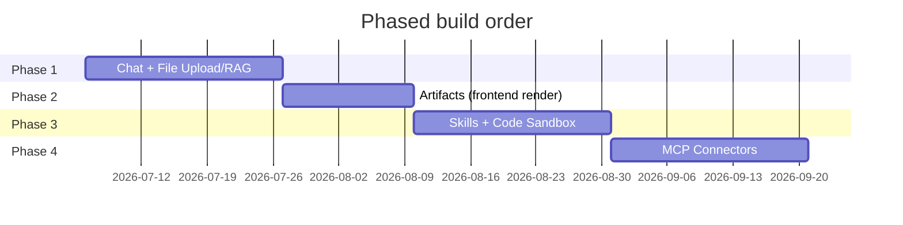
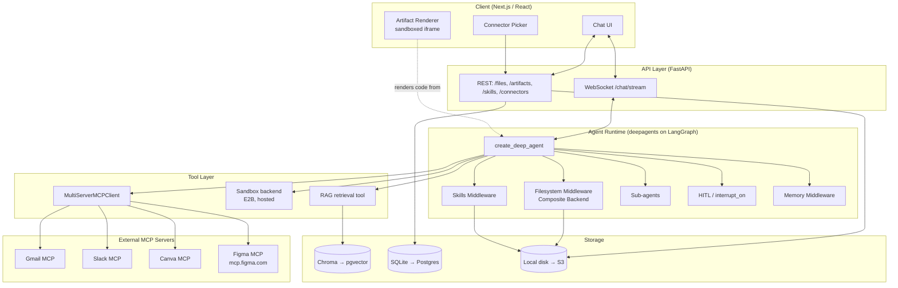
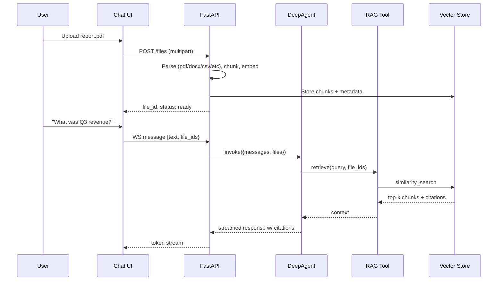

# PRD: Personal Agentic Harness ("Forge")
**Type:** Solo-project technical PRD | **Status:** Draft v1 | **Date:** July 4, 2026
**Stack:** LangChain + DeepAgents (Python) | **Deployment:** Local-first → AWS

> Working name "Forge" used throughout for readability — rename freely.

---

## 1. Overview

Forge is a self-built, Claude.ai-style agentic harness: a chat interface backed by an agent that can read uploaded files, generate and render frontend code as live "artifacts," execute code in a sandbox to build and run reusable **Skills**, and connect to external services (Gmail, Slack, Canva, Figma, etc.) via MCP.

The entire agent runtime is built on **`deepagents`** (LangChain's open-source "batteries-included agent harness," built on LangGraph) rather than a bespoke agent loop — DeepAgents already ships a virtual filesystem, planning, sub-agents, human-in-the-loop, persistent memory, a **Skills** system that implements Anthropic's Agent Skills spec, pluggable **sandbox backends**, and native MCP tool loading. This PRD is largely a plan for *composing and extending* DeepAgents' primitives with a custom UI, RAG pipeline, and connector registry — not reimplementing an agent loop.

## 2. Goals

| Goal | Success signal |
|---|---|
| Working chat + file understanding | Upload a PDF/CSV/DOCX, ask questions, get grounded answers with source references |
| Working artifacts | Ask for a React component/HTML page, see it rendered live, iterate on it |
| Working skills + sandbox | Agent (or you) authors a `SKILL.md` + script, agent later invokes it inside an isolated sandbox to perform a real action |
| Working connectors | Agent completes a real task against at least 2 live MCP servers (e.g., "summarize my last 5 Slack messages," "list my Figma file components") |
| Runs mostly on your laptop | App (chat, API, artifacts, files) needs no hosted infra for MVP; only skill/code execution calls out to a hosted sandbox (E2B), since Docker Desktop is off the table on Windows |
| Portable to AWS later | Swapping local backends (filesystem, Chroma) for cloud equivalents (S3, RDS+pgvector) requires config changes, not rewrites; the sandbox is already hosted, so no migration needed there |

## 3. Non-Goals (v1)

- Multi-tenant/multi-user auth — this is a single-user personal tool.
- Building a general-purpose visual "no-code" MCP server marketplace UI — a simple config-driven registry is enough.
- Building your own JS bundler for artifact preview — reuse an existing in-browser sandboxing/bundling library.
- High-availability, autoscaling, or SLA-grade infra — this is a personal project, not a product.
- Reproducing every Claude.ai feature (e.g., Projects, Search chats) — out of scope until the four core pillars work end-to-end.

## 4. Phased Roadmap



---

## 5. System Architecture (Target State — end of Phase 4)



### 5.1 Core stack decisions

| Layer | MVP (local) | Later (AWS) | Rationale |
|---|---|---|---|
| Agent harness | `deepagents` (`create_deep_agent`) | same | Gives planning, filesystem, skills, sub-agents, HITL, memory for free |
| Model | Cloudflare Workers AI (`@cf/moonshotai/kimi-k2.6`) via `langchain-cloudflare`'s `ChatCloudflareWorkersAI` | same — Workers AI is a hosted edge API, no change needed when the app backend moves to AWS | Tool-calling capable, agent-oriented model on Workers AI; any tool-calling LangChain chat model works, so this stays swappable |
| Backend API | FastAPI + WebSocket streaming | same, on ECS Fargate | LangGraph streams natively; FastAPI is the natural Python-first pairing |
| Frontend | Next.js + React + Tailwind | same, on Vercel/S3+CloudFront | Matches "any frontend code" artifact requirement |
| Filesystem backend | `FilesystemBackend` (local disk) | `StoreBackend`/S3-backed custom backend | DeepAgents backends are pluggable per the sandbox/filesystem contract |
| Vector store | Chroma (embedded, zero infra) | pgvector on RDS, or OpenSearch Serverless | Zero-ops for MVP; SQL-adjacent for later joins with metadata |
| Relational store | SQLite | Postgres (RDS) | Conversation/file/artifact metadata |
| Code sandbox | E2B (hosted Firecracker microVM sandbox) via `langchain_e2b.E2BSandbox` — no local Docker required | same, or swap to Daytona/Modal/AWS AgentCore if needs change | Fully hosted, so it sidesteps Docker Desktop on Windows entirely; see §8.2 |
| Connectors | `langchain-mcp-adapters` `MultiServerMCPClient` | same | First-party LangChain MCP integration |

**Assumption flagged:** Python-first implementation (DeepAgents Python + FastAPI), not the JS/TS `deepagents` variant, since you'll want Python for RAG/data tooling anyway. If you'd rather run a full-stack TS app, `deepagentsjs` mirrors nearly the same API.

---

## 6. Phase 1 — Chatbot + File Upload/RAG

### 6.1 Flow



### 6.2 Components

**File ingestion pipeline** (`POST /files`):
1. Save raw file to object storage (local disk under `./data/uploads/{file_id}/`).
2. Route by MIME type to a parser: `pypdf`/`pdfplumber` (PDF), `python-docx` (Word), `openpyxl`/`pandas` (spreadsheets), `pandas` (CSV), plain read (txt/md).
3. Chunk text (recommend `RecursiveCharacterTextSplitter`, ~800 tokens, 100 overlap).
4. Embed chunks (e.g., `voyage-3` or Anthropic-compatible embedding model, or a local `sentence-transformers` model to avoid API cost) and upsert into Chroma with metadata: `{file_id, filename, page, chunk_index}`.
5. Persist file record in SQLite: `files(id, filename, mime_type, status, uploaded_at, size_bytes)`.

**RAG retrieval tool** — a plain LangChain `@tool` function (`retrieve_from_files(query, file_ids)`) registered in `create_deep_agent(tools=[...])`. Returning chunks *with citations* (filename + page/row) lets the model ground answers and lets your UI render "Sources" links.

**Agent construction:**
```python
from deepagents import create_deep_agent
from deepagents.backends.filesystem import FilesystemBackend
from langchain_cloudflare.chat_models import ChatCloudflareWorkersAI

backend = FilesystemBackend(root_dir="./data/agent-fs")
model = ChatCloudflareWorkersAI(model="@cf/moonshotai/kimi-k2.6")

agent = create_deep_agent(
    model=model,
    backend=backend,
    tools=[retrieve_from_files],
    system_prompt=CHAT_SYSTEM_PROMPT,
)

# Streaming to the WebSocket:
async for chunk in agent.astream({"messages": [{"role": "user", "content": text}]}):
    await ws.send_json(chunk)
```

**Data model (SQLite → Postgres later):**
```
conversations(id, title, created_at)
messages(id, conversation_id, role, content, created_at)
files(id, conversation_id, filename, mime_type, status, uploaded_at, size_bytes)
file_chunks_meta(id, file_id, chunk_index, page, char_start, char_end)  -- vectors live in Chroma; this is the SQL-side join table
```

**API surface (Phase 1):**
| Method | Path | Purpose |
|---|---|---|
| POST | `/files` | Upload + ingest a file |
| GET | `/files/{id}` | Status/metadata |
| WS | `/chat/stream` | Streamed chat, accepts `{conversation_id, text, file_ids}` |
| GET | `/conversations/{id}` | History |

### 6.3 Edge cases to design for early
- Large files (>50MB) — stream-parse rather than load fully into memory; cap upload size for v1.
- Scanned/image-only PDFs — no OCR in v1; detect and tell the user rather than silently returning empty chunks.
- Duplicate uploads — hash file content, dedupe by hash to avoid re-embedding.
- Chat referencing a file that's still ingesting — block send or queue until `status: ready`.

---

## 7. Phase 2 — Artifacts (Frontend Code Generation & Live Rendering)

### 7.1 Concept
When the agent's response contains a fenced code block above a size/type threshold (React/HTML/SVG/etc.), the backend extracts it into an **artifact** record instead of leaving it inline, and the frontend renders it live next to the chat — mirroring Claude.ai's artifact UX.

### 7.2 Recommended approach: don't build a bundler from scratch
Building a Babel/esbuild-in-the-browser pipeline is a multi-week side quest on its own. For a solo project, use an existing embeddable sandbox:
- **Sandpack** (`@codesandbox/sandpack-react`) — runs a real bundler in an iframe/worker, supports React/Vue/vanilla, npm dependencies, hot reload. This is the pragmatic choice.
- For plain **HTML/SVG artifacts**, skip Sandpack entirely — just render directly in a sandboxed `<iframe sandbox="allow-scripts">` with `srcDoc`.

### 7.3 Data model
```
artifacts(id, conversation_id, message_id, type [react|html|svg|md|code], title, created_at)
artifact_versions(id, artifact_id, version, content, created_at)
```
Every re-generation creates a new version so you can diff/revert — same pattern as Claude.ai's iteration model.

### 7.4 Detection & extraction
Post-process the agent's streamed response: parse fenced code blocks, classify by language/heuristics (```jsx/```tsx → react, ```html → html, ```svg → svg), and emit an `artifact_created` event over the WebSocket alongside the text event, so the UI can pop the artifact panel open without waiting for the full message to finish streaming.

### 7.5 API surface (Phase 2)
| Method | Path | Purpose |
|---|---|---|
| POST | `/artifacts/{id}/versions` | Save a new version (agent or manual edit) |
| GET | `/artifacts/{id}` | Latest + version history |
| GET | `/artifacts/{id}/versions/{v}` | Specific version |

---

## 8. Phase 3 — Code Sandbox + Skills

This is the phase where DeepAgents does the most work for you — **Skills are a first-class DeepAgents feature**, not something to build from scratch.

### 8.1 Skills — use DeepAgents' native Skills system
Skills follow the same spec Claude Code/Claude.ai use: a folder with a `SKILL.md` (YAML frontmatter + Markdown instructions) plus optional supporting files (scripts, references, templates).

```
skills/
  pdf-report-generator/
    SKILL.md
    generate.py
    template.html
```

```yaml
---
name: pdf-report-generator
description: Generate a formatted PDF report from structured data
license: MIT
---
# PDF Report Generator
## When to use
Use when the user asks for a PDF report/summary document from data already in context.
## How
1. Populate template.html with the data
2. Run `python generate.py --input data.json --output report.pdf`
```

Wire it into the agent:
```python
agent = create_deep_agent(
    model=model,  # ChatCloudflareWorkersAI(model="@cf/moonshotai/kimi-k2.6")
    backend=FilesystemBackend(root_dir="./data/agent-fs"),
    skills=["./skills/"],
    tools=[...],
)
```
DeepAgents' `SkillsMiddleware` loads only each skill's name/description into the system prompt at startup (progressive disclosure — cheap on tokens); the agent reads the full `SKILL.md` only when a task matches. Skills are layerable (`sources=["/skills/base/", "/skills/user/", "/skills/project/"]`, last one wins on name collision) — useful later if you want "base" skills vs. project-specific overrides.

**Letting the agent author new skills:** give it filesystem write access to the skills directory and a system-prompt instruction to write a `SKILL.md` + script when it solves a novel repeatable task — this is explicitly one of the design intents behind Agent Skills (a step toward continuous learning).

### 8.2 Code sandbox backend — recommendation (revised: hosted, no Docker)
Since Docker Desktop is off the table (Windows, and you'd rather not manage local sandboxing at all), skip local sandboxing entirely and run skill execution in a **hosted sandbox provider**. DeepAgents already ships first-party backends for this, so there's no custom backend to build — the Docker plan from the earlier draft is no longer needed.

**Recommendation: E2B**
- Free Hobby tier: one-time $100 usage credit, no credit card required, up to 1-hour sandbox sessions, 20 concurrent sandboxes — comfortably covers solo/personal use.
- Sandboxes run in isolated Firecracker microVMs on E2B's own infrastructure — stronger isolation than you actually need, but it costs nothing extra and means zero local setup on Windows (no Docker Desktop, no WSL2).
- Has a ready-made DeepAgents backend (`langchain_e2b.E2BSandbox`), so wiring it in is a few lines.

```python
from deepagents import create_deep_agent
from e2b import Sandbox
from langchain_e2b import E2BSandbox

e2b_sandbox = Sandbox.create()   # needs E2B_API_KEY set in your environment
sandbox = E2BSandbox(sandbox=e2b_sandbox)

agent = create_deep_agent(
    model=model,  # ChatCloudflareWorkersAI(model="@cf/moonshotai/kimi-k2.6")
    backend=sandbox,
    skills=["./skills/"],
)
```
Setup is: sign up at e2b.dev, generate an API key, set it as `E2B_API_KEY`. Nothing runs on your machine.

**If you outgrow E2B's 1-hour session cap or 20-sandbox concurrency later:** Daytona (similar pricing, ~90ms cold starts, container-based isolation) and Modal (Python-first, GPU-capable, $30/month free credits) both already have DeepAgents backends — swapping is a one-line backend change, not a rewrite.

**If you're already using LangSmith:** LangSmith Sandboxes are first-party managed sandboxes usable directly via `from langsmith.sandbox import SandboxClient` with no third-party signup at all — the least setup of any option if you're already in the LangChain/LangSmith ecosystem.

### 8.3 Guardrails (hosted-sandbox version)
- Per-skill execution timeout, enforced in your own code and backed by the provider's session cap (E2B's Hobby tier already caps sessions at 1 hour).
- Nothing from your local machine is ever mounted into the sandbox — it's a separate cloud VM by construction, so this guardrail comes for free with a hosted provider.
- **Flagging a real tradeoff from switching off local Docker:** the earlier plan defaulted to `--network none`; E2B sandboxes have outbound internet access by default. With "light isolation is fine" that's an acceptable tradeoff for a personal project, but if a specific skill shouldn't be able to make arbitrary outbound calls, restrict its egress explicitly rather than assuming it's sandboxed by default.
- Route destructive/sensitive skill actions through DeepAgents' `interrupt_on` (HITL) so you approve before execution — same mechanism used for MCP tool approval in Phase 4.

### 8.4 Security note (must validate before enabling any auto-generated skill)
DeepAgents follows a **"trust the LLM, enforce boundaries at the tool/sandbox level"** model — i.e., it deliberately does *not* rely on the model self-policing. Your sandbox's isolation is the actual security boundary, not a system prompt instruction. Treat this as non-negotiable before letting the agent execute arbitrary generated code, even on your own laptop.

---

## 9. Phase 4 — MCP Connectors

### 9.1 Use `langchain-mcp-adapters` directly — don't write a custom MCP client
```python
from langchain_mcp_adapters.client import MultiServerMCPClient
from deepagents import create_deep_agent

mcp_client = MultiServerMCPClient({
    "figma": {
        "transport": "streamable_http",
        "url": "https://mcp.figma.com/mcp",
        "auth": figma_oauth_auth,       # httpx.Auth-compatible OAuth handler
    },
    "slack": {
        "transport": "http",
        "url": "https://your-slack-mcp-host/mcp",
        "headers": {"Authorization": f"Bearer {slack_token}"},
    },
})
mcp_tools = await mcp_client.get_tools()
agent = create_deep_agent(model=model, tools=[*mcp_tools, retrieve_from_files])  # model = ChatCloudflareWorkersAI(...)
```

### 9.2 Connector registry (config-driven, not hardcoded)
```yaml
# connectors.yaml
- id: figma
  name: Figma
  transport: streamable_http
  url: https://mcp.figma.com/mcp
  auth: oauth2
  enabled: false   # user must explicitly connect

- id: gmail
  name: Gmail
  transport: http
  url: <your Gmail MCP host>
  auth: oauth2
  enabled: false
```
The backend reads this file/table, and only builds `MultiServerMCPClient` entries for connectors the user has explicitly connected (mirrors the "suggest, then user opts in" UX pattern rather than auto-wiring every service on).

### 9.3 OAuth handling
Most real-world MCP servers (Gmail, Slack, Figma, Canva) are OAuth2-protected resource servers. Plan for:
1. A local loopback OAuth redirect handler in your FastAPI app (`/connectors/{id}/callback`) — standard "installed app" OAuth flow.
2. Encrypted token storage at rest (e.g., `cryptography.Fernet` with a locally-held key, or your OS keychain via `keyring`) — not plaintext in SQLite.
3. A refresh-token cycle wired into an `httpx.Auth` implementation passed as the `auth` param to `MultiServerMCPClient`, so token refresh is transparent to the agent.
4. Store only per-connector scopes actually needed (least privilege), and let users revoke per-connector, not globally.

### 9.4 Verified connector status (fact-checked — don't take this as fixed, re-verify at build time)
- **Figma**: has an official, actively maintained **remote MCP server** at `https://mcp.figma.com/mcp`, OAuth-based, with read (`get_design_context`) and write-to-canvas tools. This is the most "just works" connector of the four.
- **Canva**: has published an MCP server for design generation, oriented around Brand Kit-driven asset creation; check Canva's current developer docs for the exact endpoint and auth flow before wiring it in, since design/AI connector offerings in this space have been moving fast in 2026.
- **Gmail / Slack**: neither Google nor Slack ships a first-party MCP server as broadly documented as Figma's at the time of writing. Practical options are (a) a community/open-source MCP server for each, or (b) a hosted MCP aggregator (e.g., Composio, Klavis) that fronts OAuth for many SaaS tools behind one MCP endpoint — this can meaningfully cut integration time for exactly the "N services, N OAuth flows" problem you're solving here. Confirm current server availability and auth model for each before committing engineering time.

### 9.5 Human-in-the-loop for sensitive actions
Use DeepAgents' built-in HITL support to gate irreversible connector actions (sending an email, posting to Slack, deleting a Figma layer) behind explicit approval:
```python
agent = create_deep_agent(
    model=model,  # ChatCloudflareWorkersAI(model="@cf/moonshotai/kimi-k2.6")
    tools=[*mcp_tools],
    interrupt_on={
        "send_email": {"allowed_decisions": ["approve", "edit", "reject"]},
        "post_message": {"allowed_decisions": ["approve", "reject"]},
    },
)
```

---

## 10. Cross-cutting: Deployment

**Local (Phases 1–4 MVP):**
```yaml
# docker-compose.yml (sketch)
services:
  api:        # FastAPI + deepagents runtime
  frontend:   # Next.js
  chroma:     # vector store
  # no sandbox service here — skill execution calls out to E2B's hosted API, not a local container
```
SQLite and local disk mean zero additional services for the DB/storage layer. Docker (if you use it at all) is only running your own `api`/`frontend`/`chroma` containers here — not the code sandbox, which is hosted on E2B from day one.

**AWS migration (post-MVP):**
| Local piece | AWS equivalent |
|---|---|
| SQLite | RDS Postgres |
| Local disk uploads | S3 |
| Chroma | pgvector on RDS, or OpenSearch Serverless |
| FastAPI container | ECS Fargate (or App Runner for less ops) |
| E2B sandbox | No change needed — it's already hosted; optionally move to AWS Bedrock AgentCore later if you want everything inside AWS's network |
| Secrets (OAuth tokens) | AWS Secrets Manager / KMS-encrypted RDS column |

Because DeepAgents' filesystem and sandbox are both backend-abstracted, this migration is primarily a matter of writing/selecting new backend adapters and updating environment config — not restructuring the agent.

---

## 11. Risks & Open Questions

| Risk | Notes |
|---|---|
| Sandbox escape / resource abuse from generated skill code | Mitigate per §8.3–8.4; don't skip network/resource limits even "just for personal use" |
| MCP server landscape is moving fast | Gmail/Slack connector choice (§9.4) needs a fresh check right before implementation, not just at PRD time |
| Artifact bundler (Sandpack) dependency risk | If Sandpack's hosted bundler service has availability issues, React artifact preview breaks; have an HTML/SVG-only fallback path |
| Embedding cost/quality tradeoff | Local `sentence-transformers` avoids API cost but is lower quality than hosted embeddings — revisit if retrieval quality is poor |
| Scope creep across 4 phases | Each phase should ship a working demo before starting the next; resist starting Phase 3 skills before Phase 1 RAG is solid |

---

## 12. Key References
- DeepAgents overview & repo: https://github.com/langchain-ai/deepagents
- DeepAgents Skills docs: https://docs.langchain.com/oss/python/deepagents/skills
- DeepAgents Sandboxes docs: https://docs.langchain.com/oss/python/deepagents/sandboxes
- langchain-mcp-adapters: https://github.com/langchain-ai/langchain-mcp-adapters
- MCP + LangChain auth guide: https://docs.langchain.com/oss/python/langchain/mcp
- Figma MCP server: https://developers.figma.com/docs/figma-mcp-server/
- Agent Skills specification: https://agentskills.io/specification
