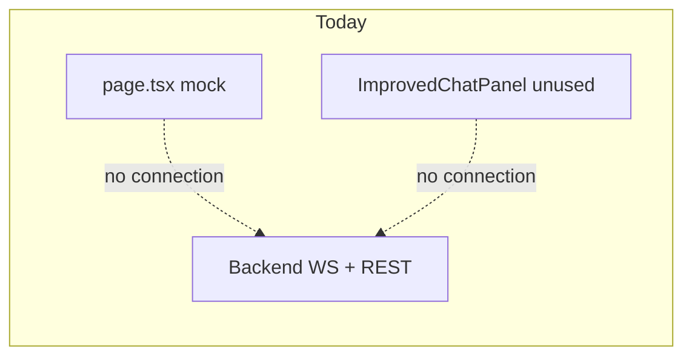
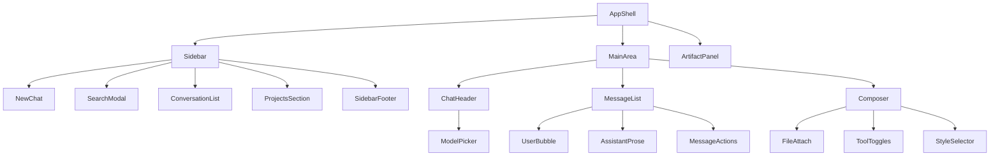

# Claude.ai Full UI Parity Plan

## Current State

The live route ([`frontend/src/app/page.tsx`](frontend/src/app/page.tsx)) renders a **mock chat** with local state and `setTimeout` replies. It does not use the real data layer (`useChat`, `chatStore`, WebSocket) at all.

Meanwhile, [`ImprovedChatPanel.tsx`](frontend/src/components/ImprovedChatPanel.tsx) and [`ImprovedMessageBubble.tsx`](frontend/src/components/ImprovedMessageBubble.tsx) exist but are **untracked and unwired**. They import `framer-motion`, which is **not in `package.json`** and will fail at build time.

Design tokens exist in [`globals.css`](frontend/src/app/globals.css) but have critical bugs: forced `color-scheme: dark`, missing Tailwind `@theme` mappings for `background-muted`/`on-primary`, broken font CSS vars, unreadable user-message colors, and no highlight.js / typography plugin CSS.

---

## Target Architecture

Match claude.ai's three regions with system-theme support and a manual toggle:

**Message layout rules (claude.ai pattern):**
- User: right-aligned pill, `max-w-[75%]`, warm gray fill (`#DDD9CE` light / `#393937` dark)
- Assistant: full-width flat prose on canvas — no bubble, no avatar
- Thread: centered column `max-w-3xl mx-auto`
- Composer: sticky bottom, border-only (no shadow), integrated tool chips

---

## Phase 1 — Foundation Fixes (unblock everything)

### 1.1 Design system ([`globals.css`](frontend/src/app/globals.css) + [`layout.tsx`](frontend/src/app/layout.tsx))

- Remove duplicate `color-scheme: dark` overrides; default to **system preference** with a `data-theme` attribute toggled from settings
- Register all semantic tokens in `@theme`: `--color-background-muted`, `--color-on-primary`, etc.
- Fix `.claude-message-user` to use `color: var(--foreground)` (not white on 10% coral)
- Set `--font-inter` via `inter.style.fontFamily` on `<html>`
- Add `@tailwindcss/typography` + `highlight.js` theme import for markdown/code
- Remove duplicate `.claude-focus-ring` / `.claude-glow-text` blocks
- Add `prefers-reduced-motion` overrides per ui-ux skill

### 1.2 Dependencies ([`package.json`](frontend/package.json))

Add:
- `framer-motion` (or replace with CSS transitions to reduce bundle — prefer CSS where possible)
- `@tailwindcss/typography`
- `react-resizable-panels` (artifact split pane)
- `@codesandbox/sandpack-react` (React artifact preview)
- `cmdk` (Cmd+K search modal)

### 1.3 Fix broken data wiring

| Bug | Fix location |
|-----|-------------|
| `stopStreaming` missing | [`useChat.ts`](frontend/src/hooks/useChat.ts) — track `wsRef`, expose `stopStreaming`, handle `onclose` |
| `file_ids` ignored | [`chat.py`](backend/app/api/chat.py) — read `file_ids`, pass to `stream_agent` → RAG tool |
| Wrong upload IDs | [`FileUpload.tsx`](frontend/src/components/FileUpload.tsx) — replace temp ID with `res.file_id` |
| `conversation_id` lost | [`useChat.ts`](frontend/src/hooks/useChat.ts) — capture from `done` event, update `chatStore` |
| Hardcoded WS URL | Derive from `NEXT_PUBLIC_API_URL` (`ws://` / `wss://`) |
| Attach button no-op | Wire `Plus` to hidden file input in composer |

### 1.4 Replace mock page

Rewrite [`page.tsx`](frontend/src/app/page.tsx) to render `<AppShell />` instead of inline mock chat. Delete or consolidate [`ChatPanel.tsx`](frontend/src/components/ChatPanel.tsx) and [`MessageBubble.tsx`](frontend/src/components/MessageBubble.tsx) after migration.

---

## Phase 2 — App Shell + Sidebar + Core Chat UX

### 2.1 New layout components

Create under `frontend/src/components/layout/`:

| Component | claude.ai behavior |
|-----------|-------------------|
| `AppShell.tsx` | `h-screen flex`; sidebar + main + optional artifact panel |
| `Sidebar.tsx` | 260px collapsible (`Cmd+Shift+O`); mobile drawer |
| `NewChatButton.tsx` | Clears messages, resets `activeConversationId` |
| `ConversationList.tsx` | Groups by Today / Previous 7 days / Older; star support |
| `SearchModal.tsx` | `Cmd+K` overlay; semantic search (Phase 4 backend) |
| `ProjectsSection.tsx` | Expandable project folders (Phase 5 backend) |
| `SidebarFooter.tsx` | Settings link, theme toggle, account placeholder |
| `ThemeToggle.tsx` | System / Light / Dark — persisted to `localStorage` |

### 2.2 Conversation lifecycle

New hook [`useConversations.ts`](frontend/src/hooks/useConversations.ts):
- On mount: `getConversations()` → populate `chatStore.conversations`
- On switch: `getConversation(id)` → load messages
- On new message `done`: refresh sidebar title

Extend [`api.ts`](frontend/src/lib/api.ts) + backend [`conversations.py`](backend/app/api/conversations.py):
- `POST /conversations/` — explicit create
- `PATCH /conversations/{id}` — rename
- `DELETE /conversations/{id}` — delete
- `POST /conversations/{id}/star` — pin/unpin

DB migration in [`models.py`](backend/app/models.py): add `starred: bool`, `updated_at` to `conversations`.

### 2.3 Chat column refactor

Decompose [`ImprovedChatPanel.tsx`](frontend/src/components/ImprovedChatPanel.tsx) into:

- `chat/ChatHeader.tsx` — model picker dropdown (top of chat)
- `chat/EmptyState.tsx` — sparkle icon + "How can I help you today?" + suggestion chips
- `chat/MessageList.tsx` — scroll container, `max-w-3xl mx-auto`
- `chat/Composer.tsx` — textarea auto-resize, attach, send/stop, disclaimer footer
- `chat/ToolToggles.tsx` — web search, extended thinking, style selector chips

Rewrite [`ImprovedMessageBubble.tsx`](frontend/src/components/ImprovedMessageBubble.tsx):
- Remove assistant avatar and bubble background
- User: right-aligned warm pill only
- Assistant: flat full-width `prose` with hover action bar (copy, thumbs up/down, retry)
- Action bar: `opacity-0 group-hover:opacity-100` floating pill (claude.ai pattern)

### 2.4 Model picker (UI + backend)

Frontend `ModelPicker.tsx`: Sonnet / Opus / Haiku options (mapped to available Cloudflare models).

Backend:
- `GET /models` — list available models from config
- Extend WS payload: `model_id`, `style`, `enable_web_search`, `enable_thinking`
- [`factory.py`](backend/app/agent/factory.py) — build agent with selected model; pass thinking/search flags to prompt/tools

---

## Phase 3 — Artifacts Panel

### 3.1 Backend stream integration

Wire existing [`detector.py`](backend/app/agent/artifacts/detector.py) into [`chat.py`](backend/app/api/chat.py) streaming loop:
- Emit `{type: "artifact", data: {id, type, title, content}}` mid-stream
- Auto-create artifact rows in DB
- Add `message_id` FK to `artifacts` table

New endpoints in [`artifacts.py`](backend/app/api/artifacts.py):
- `GET /artifacts?conversation_id=...` — list artifacts for active chat
- `GET /conversations/{id}/artifacts` — convenience alias

### 3.2 Frontend artifact panel

Create under `frontend/src/components/artifacts/`:

| Component | Behavior |
|-----------|----------|
| `ArtifactPanel.tsx` | Right resizable pane; opens on `artifact` WS event |
| `ArtifactTabs.tsx` | Switch between multiple artifacts in one chat |
| `ArtifactRenderer.tsx` | Sandpack for React, `iframe srcDoc` for HTML/SVG, highlighted code for plain code |
| `VersionSelector.tsx` | Browse artifact version history |

Extend [`useChat.ts`](frontend/src/hooks/useChat.ts) to handle `artifact` events; new [`useArtifacts.ts`](frontend/src/hooks/useArtifacts.ts) for REST fetch.

New `uiStore.ts`: `artifactPanelOpen`, `activeArtifactId`, `sidebarOpen`, `searchOpen`.

---

## Phase 4 — Advanced Chat Features

### 4.1 Conversation search

Backend:
- `GET /conversations/search?q=...` — SQLite FTS5 index on `messages.content` + `conversations.title`
- Return ranked results with snippet previews

Frontend: wire `SearchModal` to search API; keyboard nav; click to switch conversation.

### 4.2 Message branching + edit

Backend schema change:
- Add `parent_message_id`, `branch_id` to `messages` table
- `POST /conversations/{id}/branch` — fork from edited message
- `POST /messages/{id}/regenerate` — retry assistant response (optionally with new model)

Frontend:
- Hover edit icon on user messages → inline editor → branch
- Retry button on assistant messages → calls regenerate API
- Version selector under branched messages

### 4.3 Share links

Backend:
- Add `share_token` (nullable UUID) to `conversations`
- `POST /conversations/{id}/share` — generate public token
- `GET /shared/{token}` — read-only conversation view (no auth for personal use)

Frontend: share icon in chat header → copy link toast.

### 4.4 Composer tool toggles (functional)

| Toggle | Backend work |
|--------|-------------|
| Web search | New `web_search` tool in agent; gated by `enable_web_search` flag |
| Extended thinking | Emit `{type: "thinking", data: "..."}` events; show collapsible thinking block in UI |
| Style selector | Pass `style` to system prompt template in [`prompts.py`](backend/app/agent/prompts.py) |
| File attach | Already partially built; finish `conversation_id` association on upload |

### 4.5 Citations

- Parse RAG tool output `[Source: filename, Page N]` during stream
- Emit `{type: "citation", data: {...}}` events
- Populate `messages.citations` JSON column
- Render via existing [`SourceCitation.tsx`](frontend/src/components/SourceCitation.tsx)

---

## Phase 5 — Projects

> Note: The PRD defers Projects, but you selected full parity — this phase adds them.

### 5.1 Backend

New `projects` table: `id`, `name`, `description`, `custom_instructions`, `created_at`.

Extend `conversations`: add `project_id` FK (nullable).

Endpoints:
- `GET/POST/PATCH/DELETE /projects/`
- `GET /projects/{id}/conversations`
- `POST /projects/{id}/conversations` — create chat inside project

Project custom instructions injected into system prompt when chatting within a project.

### 5.2 Frontend

- `ProjectsSection.tsx` in sidebar — list projects, expand to show conversations
- `ProjectView.tsx` — project detail with instructions editor
- "Move to project" action on conversations

---

## Phase 6 — Polish + Accessibility

- Keyboard shortcuts: `Cmd+K` new chat, `Cmd+/` shortcut help, `Cmd+Shift+O` sidebar, `Cmd+Shift+L` theme
- Mobile: sidebar as slide-over drawer; full-bleed messages; thumb-reachable composer
- `aria-label` on all icon buttons; visible focus rings (already partially in CSS)
- Streaming indicator: subtle pulsing cursor on assistant message (not bouncing dots)
- Settings modal: appearance (theme, font size), data controls placeholder
- Update metadata title from "Forge" to "Claude" (or keep Forge branding per your preference)

---

## File Change Summary

**Create (~25 files):** `AppShell`, `Sidebar`, `ConversationList`, `SearchModal`, `ProjectsSection`, `ChatHeader`, `ModelPicker`, `Composer`, `EmptyState`, `MessageList`, `ArtifactPanel`, `ArtifactRenderer`, `ArtifactTabs`, `ThemeToggle`, `uiStore`, `projectStore`, `useConversations`, `useArtifacts`, `cn.ts`, `constants.ts`

**Modify (~12 files):** `page.tsx`, `layout.tsx`, `globals.css`, `package.json`, `useChat.ts`, `chatStore.ts`, `api.ts`, `types.ts`, `FileUpload.tsx`, `ImprovedMessageBubble.tsx`, backend `chat.py`, `conversations.py`, `artifacts.py`, `models.py`, `factory.py`, `prompts.py`

**Delete (after migration):** `ChatPanel.tsx`, `MessageBubble.tsx`; inline mock logic in `page.tsx`

---

## Implementation Order (recommended)

```mermaid
gantt
    title Implementation Phases
    dateFormat X
    axisFormat %s

    section Foundation
    Design tokens + deps + bug fixes     :0, 1
    Wire AppShell + replace mock page    :1, 2

    section Core UX
    Sidebar + conversations              :2, 3
    Message layout + composer            :3, 4
    Model picker                         :4, 5

    section Artifacts
    Backend stream + panel               :5, 6

    section Advanced
    Search + branching + share           :6, 7
    Tool toggles + citations             :7, 8
    Projects                             :8, 9
    Polish + a11y                        :9, 10
```

Phases 1–3 deliver a visually accurate, functional claude.ai clone for daily chat. Phases 4–5 complete the advanced features you selected. Phase 6 ensures production-quality UX.

---

## Verification Checklist

After each phase, manually verify against the browser tab at `http://localhost:3000/`:

- [ ] Warm cream light / pure black dark themes match system + manual toggle
- [ ] Sidebar shows real conversation history from backend
- [ ] New chat / switch conversation works
- [ ] User messages right-aligned pills; assistant messages flat full-width
- [ ] Composer: attach file, send, stop streaming, tool toggles visible
- [ ] Model picker changes model mid-conversation
- [ ] Code blocks render with syntax highlighting
- [ ] Artifact panel opens on code generation with live Sandpack preview
- [ ] Cmd+K search finds past conversations
- [ ] Edit message branches conversation; retry regenerates
- [ ] Share link produces read-only public view
- [ ] Projects group conversations with custom instructions
